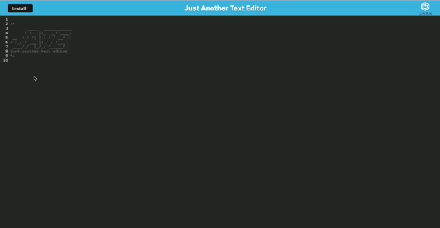

# Progressive Web Applications (PWA) Challenge: Text Editor

## Description 
This application was created to build a text editor that runs in the browser and meets the PWA criteria. The application will also function offline. 

## User Story

```md
AS A developer
I WANT to create notes or code snippets with or without an internet connection
SO THAT I can reliably retrieve them for later use
```

## Mock Up 
The following animated photo shows the web application's appearance and functionality:



## Heroku Deployment: https://zay-text-editor.herokuapp.com/ 
